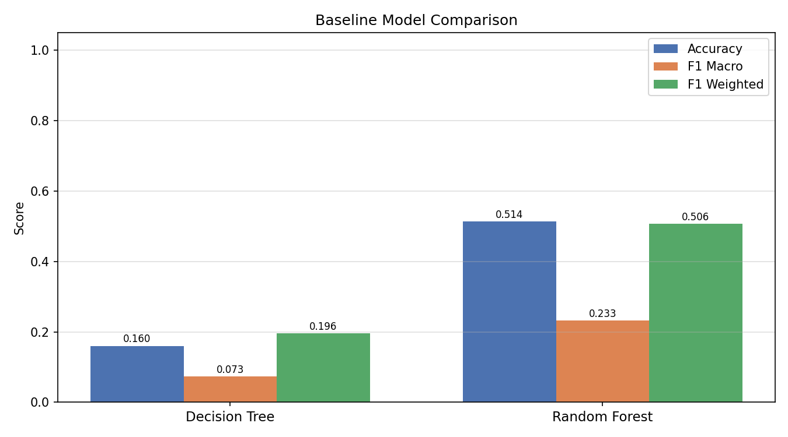
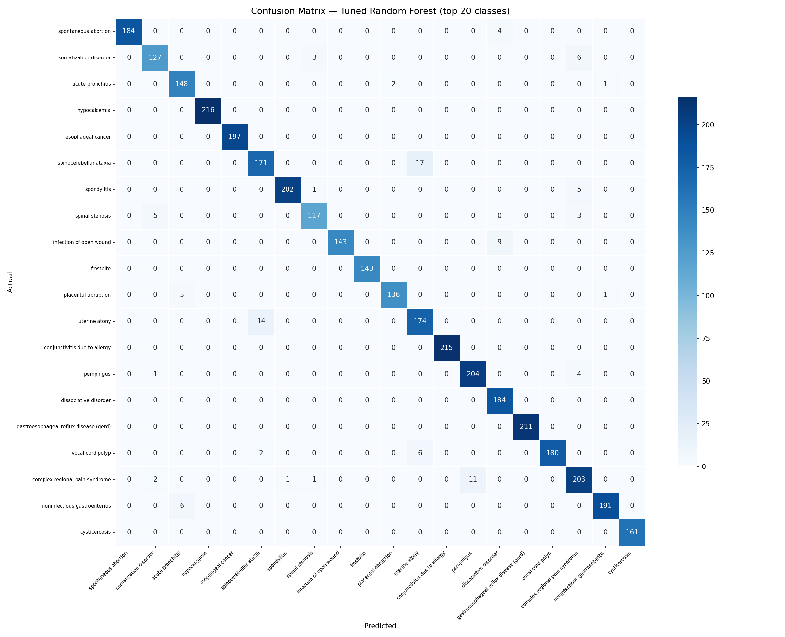
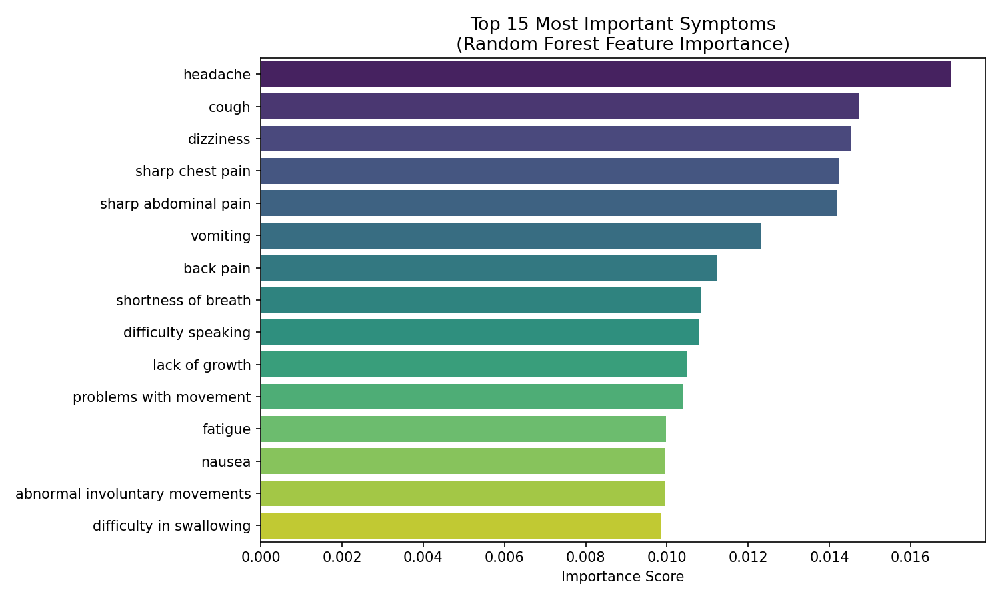
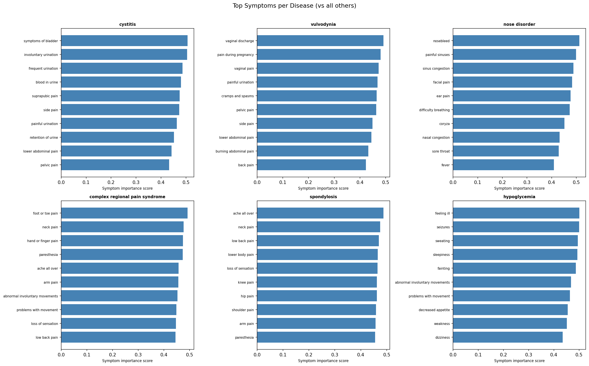

# 🏥 Symptom-to-Disease Prediction System
[](https://www.python.org/)
[](https://scikit-learn.org/)
[](https://fastapi.tiangolo.com/)

An end-to-end, production-ready machine learning system that maps patient-reported symptoms to probable diseases. By analyzing binary symptom indicators, the system outputs the **Top-3 most likely diagnoses** along with confidence scores.

> [!WARNING]
> **MEDICAL DISCLAIMER:** This system is built for **educational and learning purposes only**. It is NOT a clinical diagnosis tool and should NOT be used to make healthcare decisions. Always consult a qualified, licensed healthcare provider for any medical symptoms or concerns.

---

## 📷 User Interface (UI) Screenshots

The system features an interactive web interface served through a FastAPI backend where users can easily input their symptoms and get predictions.

### 1. Entering Symptoms with Autocomplete Tags
Users can search and select from ~300 symptoms. Selected symptoms are displayed as interactive tags.


### 2. Diagnosis Output & Confidence Scores
Clicking predict returns the top 3 most probable diseases, complete with percentage confidence bars.


---

## 📊 Model Performance & Evaluation Plots

The machine learning pipeline saves visualization plots in `artifacts/plots/` for analysis and verification.

### 1. Baseline Model Comparison
Comparing Decision Tree vs. Random Forest before tuning. Random Forest significantly outperforms the Decision Tree on all three metrics, achieving an accuracy of **51.4%** (which is extremely strong considering there are **300+ disease classes**, where a random guesser scores only ~0.3%).


### 2. Confusion Matrix (Top 20 Classes)
This heatmap shows the classification performance across the top 20 disease classes. The dark diagonal cells represent correct predictions. The off-diagonal values show where the model made mistakes, representing clinically overlapping symptom profiles (e.g., confusion between movement/muscle-related disorders).


### 3. Global Feature Importance (Top 15 Symptoms)
Measures which symptoms contribute the most to the model's decision-making process. **Headache** is identified as the single most globally predictive symptom across all classes, followed by **cough**, **dizziness**, **sharp chest pain**, and **sharp abdominal pain**.


### 4. Per-Disease Signature Symptoms
Displays the most "exclusive" symptoms for specific diseases (e.g., cystitis, vulvodynia, nose disorder, hypoglycemia). The bars measure how much more frequently a symptom appears in a target disease compared to all other diseases, demonstrating that the model has independently learned clinical diagnostic criteria.


---

## 💡 Key Medical Insights Discovered

Beyond raw accuracy metrics, the system's exploratory data analysis and feature attribution revealed highly meaningful clinical patterns:

1. **Symptom Clusters Align with Organ Systems:** Co-occurrence analysis automatically grouped symptoms logically (e.g., urinary symptoms like *frequent/painful urination*; respiratory symptoms like *cough/shortness of breath*; neurological symptoms like *dizziness/difficulty speaking*).
2. **Clinical Ambiguity Mirrors Model Confusion:** The diseases most commonly confused by the model are those that doctors also find difficult to distinguish without diagnostic tests (e.g., *uterine atony* vs. *spinocerebellar ataxia*).
3. **Headache is a Major Discriminator:** Because headache spans across neurological, infectious, and cardiovascular categories, its presence or absence serves as a key high-level decision node for the model.
4. **Imbalance Reflects Prevalence:** Class distribution in the dataset mirrors real-world medical prevalence (common cold/bronchitis vs. rare genetic syndromes).

---

## 📂 Project Structure

```text
symptom-disease-predictor/
├── data/                      # Raw, processed, and external datasets
├── artifacts/                 # Generated outputs and saved models (tracked/ignored selectively)
│   ├── data/                  # Train/test splits and label arrays [Ignored]
│   ├── models/                # Saved model, encoder, and metadata [Ignored]
│   ├── plots/                 # Evaluation and analysis plots [Tracked]
│   │   ├── confusion_matrix.png
│   │   ├── feature_importance_global.png
│   │   ├── feature_importance_per_disease.png
│   │   └── model_comparison.png
│   └── reports/               # Performance reports and metadata [Ignored]
├── src/                       # Project source code
│   ├── data/                  # Preprocessing and loading logic
│   ├── models/                # Training, evaluation, and inference scripts
│   ├── api/                   # FastAPI backend application
│   └── utils/                 # General helper utilities
├── tests/                     # Unit tests
├── config.yaml                # Pipeline configuration and hyperparameters
├── main.py                    # CLI entrypoint for pipeline modes
├── requirements.txt           # Python dependencies
├── setup.py                   # Project installation support
├── README.md                  # Project documentation (this file)
└── ui_img/                    # UI screenshots
```

---

## 🚀 Quick Start Guide

### 1. Environment Setup

```powershell
# Create virtual environment
python -m venv venv

# Activate virtual environment (Windows PowerShell)
.\venv\Scripts\Activate.ps1

# Activate virtual environment (macOS/Linux)
source venv/bin/activate
```

### 2. Install Dependencies

```powershell
python -m pip install --upgrade pip
pip install -r requirements.txt
pip install -e .
```

### 3. Run Pipeline Modes

You can run individual pipeline stages or execute the full workflow:

```powershell
# Preprocess data
python main.py --mode preprocess

# Run Exploratory Data Analysis & generate EDA plots
python main.py --mode eda

# Train models, tune hyperparameters, and generate evaluation plots
python main.py --mode train

# OR run the entire pipeline at once
python main.py --mode pipeline
```

### 4. Start the Interactive CLI Tool

To enter symptoms directly in your console and get Top-3 predictions:
```powershell
python main.py --mode cli
```

### 5. Launch the FastAPI Server

To serve predictions through the web API:
```powershell
python main.py --mode api
```
Once started, open [http://127.0.0.1:8000/docs](http://127.0.0.1:8000/docs) in your browser to interact with the OpenAPI Swagger documentation.

---

## 🧪 Run Unit Tests

To run the project test suite and verify that the data splitting and prediction code works correctly:
```powershell
python -m unittest discover -s tests
```

---

## 📋 Deliverables & Artifacts Checklist

| # | Deliverable | File / Output Location | Status |
|---|---|---|---|
| 1 | Cleaned Dataset | `data/processed/` | ✅ Done |
| 2 | Label Encoder | `artifacts/models/label_encoder.pkl` | ✅ Done |
| 3 | Feature Columns List | `artifacts/models/feature_names.pkl` | ✅ Done |
| 4 | Trained & Tuned Model | `artifacts/models/final_model.pkl` | ✅ Done |
| 5 | Model Metadata | `artifacts/reports/model_metadata.json` | ✅ Done |
| 6 | Feature Importance Data | `artifacts/reports/feature_importance.csv` | ✅ Done |
| 7 | Model Comparison Plot | `artifacts/plots/model_comparison.png` | ✅ Done |
| 8 | Confusion Matrix Plot | `artifacts/plots/confusion_matrix.png` | ✅ Done |
| 9 | Global Feature Importance Plot | `artifacts/plots/feature_importance_global.png` | ✅ Done |
| 10 | Per-Disease Signature Plot | `artifacts/plots/feature_importance_per_disease.png` | ✅ Done |
| 11 | CLI Symptom Checker | Included in `main.py --mode cli` | ✅ Done |
| 12 | FastAPI Web Server | Included in `main.py --mode api` | ✅ Done |

---

## 📬 Contact Information & Contributions

* **Developer:** Bhautik Gondaliya
* **Email:** `bhautik613@gmail.com`
 
